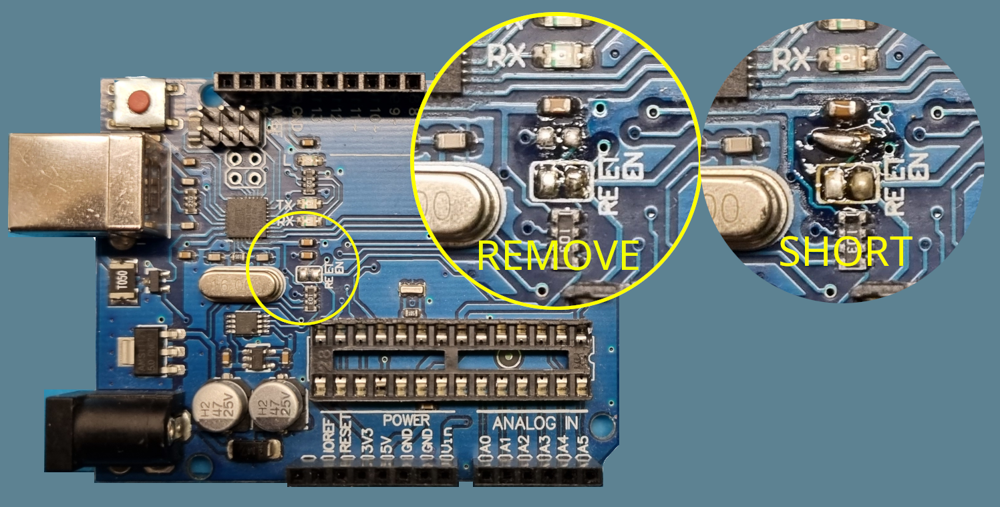
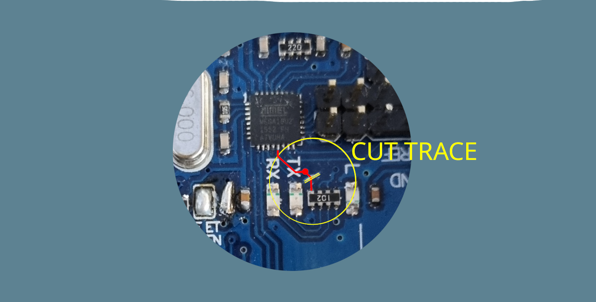

# Ardwino
## DebugWire enabling Arduino board modification

### Table of contents
- [What this is](#what-this-is)
- [What this is not](#what-this-is-not)
- [Hardware modifications](#hardware-modifications)
- [How it works](#how-it-works)
- [Software tools](#software-tools)
- [Working with avr-gdb](#working-with-avr-gdb)
- [Integrating with IDEs](#integrating-with-ides)
  - [VSCode](#vscode)
  - [CLion](#clion)

### [What this is]

This project is a firmware modification for the ATMega16u2 used on most of the  
Arduino(c) Uno - Nano - Leonardo and clones on the market in order to add 
debugging capabilities of the target firmware.
The chip mentioned above is commonly used as a simple usb to serial converter, delegating
the target flashing operations to the bootloader the target comes pre-flashed with.

This can cause minor problems in case the target flesh gets corrupted and programmer
will be needed for recovering the chip.

The fact that a full-blown ATMega16u2 is used for a simple task like this 
--Probably for cost purposes because yes, An FT232 costs more than an MCU-- means
that we can exploit the power of the mcu for doing other _stuff_ by maintaining the 
hardware similar.

With some modifications of the board that will be explained in [Hardware modifications](#hardware-modifications)
we can make the ATMega16u2 as a GDB Server, which can be used to flash the target
without bootloader and enables the possibility to debug the target firmware.

### [What this is not]

This is not a hardware product nor an Arduino(c) compatible firmware.
This is a standalone firmware that can be _also_ flashed on Arduino(c) or compatible
boards because of pinout compatibility.

### [How it works]

The ATMega16u2 will be seen by the host operating system as a USB-CDC Device.
The target **does not** implement an usb to serial converter, but communicates to the
software on the host system to debug and flash the target.

The firmware is designed to work with the following connections
```
                    ATMega16u2                            ISP Connector (Out) 
                   +----------------+                           +--+
                   |            MISO|---------------------------|  |
<------------------|USB_P       MOSI|---------------------------|  |
<------------------|USB_N        SCK|---------------------------|  |
<to/from host usb  |         TGT_RST|---------------------+-----|  |
                   |                |                     |     +--+
                   |          LED_DW|--|<|-|RES|---| VCC  | 
     +-|BTN|-------|RST_BTN  LED_GDB|--|<|-|RES|-+-| VCC  |    +----+
     |             +----------------+            +--|RES|-+----|RST |
    ---                                                        +----+
    GND                                                        Target
```

Specifically the connections are the following:

| MCU Pin | MCU Pin Name | Connection                      | Notes                             |
|---------|--------------|---------------------------------|-----------------------------------|
| 30      | D-           | HOST USB-                       | See datasheet for connections     |
| 29      | D+           | HOST USB+                       | See datasheet for connections     |
| 17      | PB3          | ISP - MOSI                      | Spi programming in and out        |
| 16      | PB2          | ISP - MISO                      | Spi programming in and out        |
| 15      | PB1          | ISP - SCK                       | Spi programming in and out        |
| 20      | PB6          | pushbutton to gnd               | target reset switch               |
| 11      | PD5          | Led with resistor from vcc      | GDB Led indicator                 |
| 10      | PD4          | Led with resistor from vcc      | Debug Wire Halted led indicator   |
| 13      | PD7          | Target ~RST/dW with Pull up 10k |                                   |
| 13      | PD7          | ISP - Reset                     | Used for isp programming a target |

When started the firmware will try to halt, reset and restart the target mcu.
After this operation, avr-gcc can be used to connect to the server through the virtual
serial exposed by the usb endpoint and enter the debug session. (see [Working with avr-gdb](#working-with-avr-gdb))

Target flashing can be archived with gdb restore command inside a debug session.
_Note: Final flushing occurs when a non memory related command is issued after the
memory write. Be sure to detach after flashing._

The only exception to the workflow occurs when the serial connection is made with a 
(virtual) baud rate of 1200 baud. (Virtual baud rate is what the control structure is set;
on usb CDC devices communication happens at max usb speed)

In this case the firmware will behave as a serial to spi converter, by disabling the debug
wire activities and pins and gdb activities for writing on the spi bus with target 
reset line constantly low. (some avr have reset active high, those are not compatible)

Every character sent from the serial communication will be sent on the spi bus and any response 
received will be replied. An avrdude programmer will be written in the future.

### [Hardware modifications]

Because of pinout compatibility, this firmware can be flashed on an Arduino(c) board
(UNO or alike, Uno is the only board this has been tested.)

In order for the firmware to work, some modifications are needed:
(References are made from the official Arduino Uno R3 Schematics [available online](https://www.arduino.cc/en/uploads/Main/Arduino_Uno_Rev3-schematic.pdf))
 1) Remove and short `C5`
 2) Cut the trace connecting `RESET` button to the target reset pin.
 3) Cut the trace connecting to `RN2D`
 4) Add a jumper wire from the `RESET` pushbutton to pin 2 (PB6) of `JP2`






### [Software tools]

todo

### [Working with avr-gdb]

todo


### [Integrating with IDEs]

todo

#### [VSCode]

todo


#### [CLion]

todo
